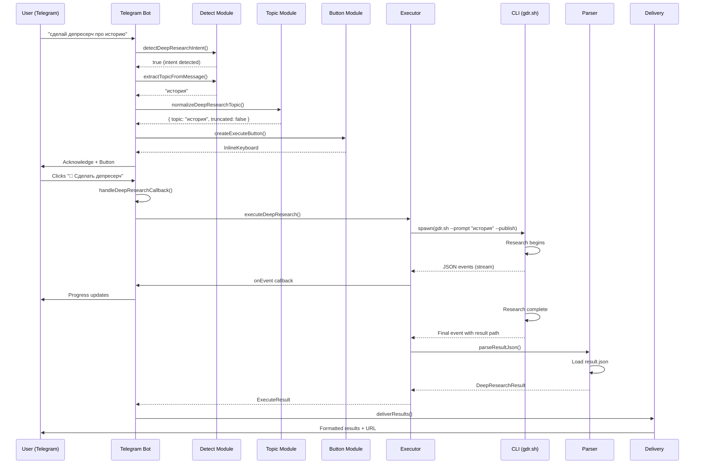
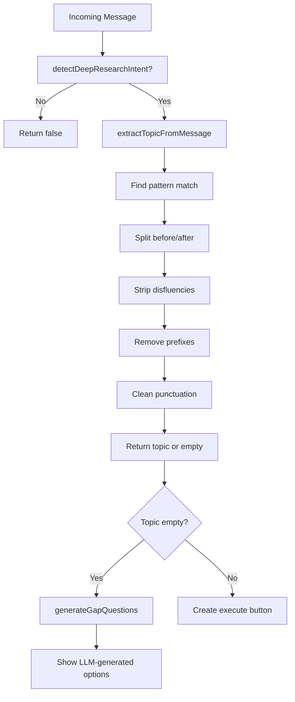
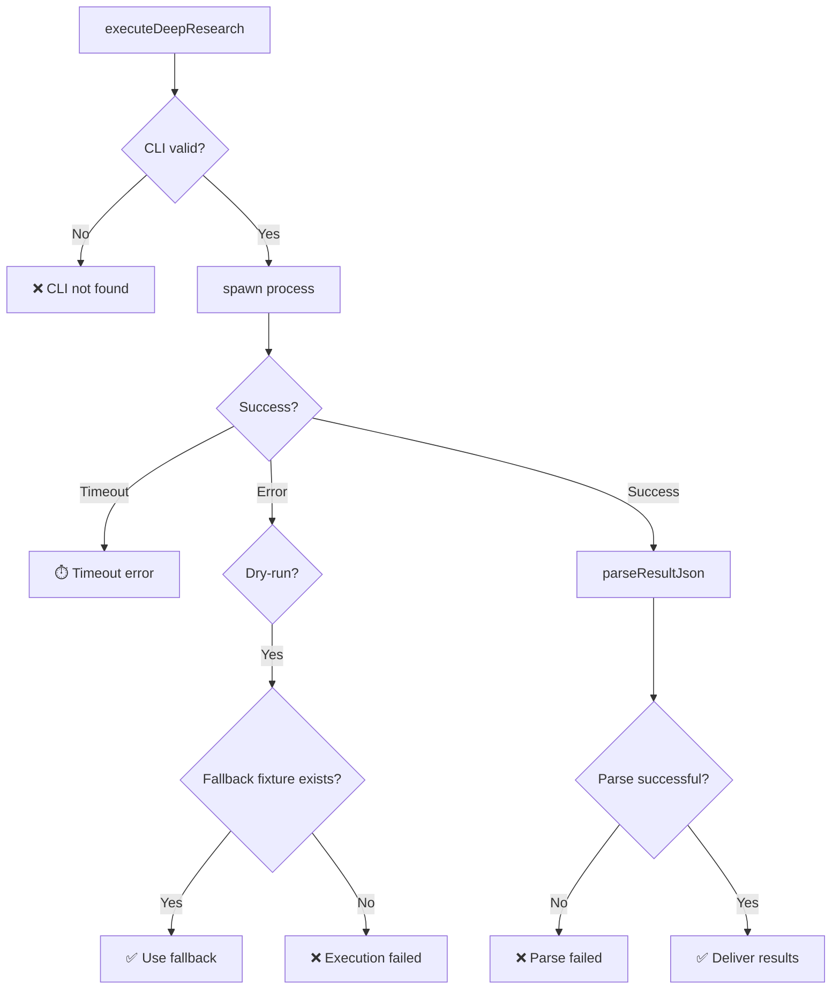

# Deep Research Pipeline - Advanced Documentation

## Table of Contents
1. [Overview](#overview)
2. [Complete Pipeline Flow](#complete-pipeline-flow)
3. [Module Architecture](#module-architecture)
4. [Configuration](#configuration)
5. [Error Handling & Troubleshooting](#error-handling--troubleshooting)
6. [Integration Points](#integration-points)
7. [Data Flow Diagrams](#data-flow-diagrams)

---

## Overview

The Deep Research system is a comprehensive pipeline that allows users to trigger in-depth research on topics via Telegram bot interface. The system uses voice transcription, intent detection, topic normalization with LLM, and orchestrates external CLI tools for research execution. The pipeline is fully integrated with the Telegram messaging platform and provides real-time progress updates.

### Key Features
- **Multi-language Support**: Russian ("депресерч", "дип рисерч") and English ("deep research") trigger patterns
- **Intent Detection**: Flexible keyword matching with support for disfluencies and partial matches
- **Topic Normalization**: LLM-powered topic refinement with gap question generation
- **Streaming Execution**: Real-time progress tracking with Telegram message updates
- **Result Parsing**: Structured extraction of research findings with publication URLs
- **Multi-user Safety**: Concurrent execution management with in-flight tracking

---

## Complete Pipeline Flow

### 1. **Message Arrival & Intent Detection**

**Files Involved:**
- [src/telegram/bot.ts](file:///home/almaz/zoo_flow/clawdis/src/telegram/bot.ts#L292-L346)
- [src/deep-research/detect.ts](file:///home/almaz/zoo_flow/clawdis/src/deep-research/detect.ts)

**Flow:**
```
User sends message to Telegram
    ↓
[handleDeepResearchMessage] - src/telegram/bot.ts:292
    ↓
detectDeepResearchIntent() - src/deep-research/detect.ts:99
    ├─ Check custom patterns from config (deepResearch.keywords)
    ├─ Match against DEEP_RESEARCH_PATTERNS (32 preset patterns)
    ├─ FLEXIBLE_RU_TRIGGER_RE: Matches "сделай/запусти/нужен + depression/deep-research"
    ├─ FLEXIBLE_MIXED_TRIGGER_RE: Handles mixed Russian-English (e.g., "дип рисерч")
    └─ TOKEN_THEN_PREP_RE: Detects "deep research/депресерч + на тему/про/по"
```

**Trigger Patterns (src/deep-research/detect.ts:6-32):**
- Group 1: Russian "депресерч" variations
  - "сделай депресерч", "запусти депресерч", "нужен депресерч", "депресерч по"
- Group 2: Russian phonetic ("дип рисерч")
  - "сделай дип рисерч", "сделать дип рисерч"
- Group 3: English variations
  - "do deep research", "run deep research", "start deep research"
- Group 4: Mixed Russian-English
  - "сделай deep research", "запусти deep research"

### 2. **Topic Extraction**

**Files Involved:**
- [src/deep-research/detect.ts](file:///home/almaz/zoo_flow/clawdis/src/deep-research/detect.ts#L123-L226)

**Flow:**
```
extractTopicFromMessage(messageText)
    ├─ Find pattern match in message
    ├─ Split before/after trigger
    ├─ Strip disfluencies: "эм", "ну", "значит", "короче", "типа", "как бы"
    ├─ Remove polite prefixes: "пожалуйста", "плиз", "пж"
    ├─ Remove command prefixes: "сделай", "запусти", "нужен"
    ├─ Remove preposition prefixes: "про", "по", "на тему"
    └─ Clean spacing, punctuation → Return extracted topic
```

**Example Extraction:**
```
Input:  "Привет, сделай депресерч про историю интернета"
Output: "история интернета"

Input:  "ну, типа, запусти deep research о климатических изменениях"
Output: "климатических изменениях"
```

### 3. **Topic Normalization (Basic)**

**Files Involved:**
- [src/deep-research/topic.ts](file:///home/almaz/zoo_flow/clawdis/src/deep-research/topic.ts)

**Flow:**
```
normalizeDeepResearchTopic(extractedTopic)
    ├─ Replace multiple spaces with single space
    ├─ Trim whitespace
    ├─ If empty → return null
    └─ Return { topic, truncated: false }
```

**Validation:**
- MAX_DEEP_RESEARCH_TOPIC_LENGTH = 240 characters
- Empty topics trigger gap question generation

### 4. **Gap Question Generation (Fallback)**

**Files Involved:**
- [src/deep-research/gap-questions.ts](file:///home/almaz/zoo_flow/clawdis/src/deep-research/gap-questions.ts)
- [prompts/deep-research/gap-questions.json](file:///prompts/deep-research/gap-questions.json) (config file)

**Triggered When:** Topic normalization returns empty or too short

**Flow:**
```
generateGapQuestions({ request: messageText })
    ├─ Load gap-questions.json config
    ├─ Normalize request (max 500 chars)
    ├─ Create agent workspace
    ├─ Resolve model (DEFAULT_PROVIDER, DEFAULT_MODEL)
    ├─ Render prompt template with:
    │   ├─ request
    │   ├─ questionCount (from config)
    │   ├─ minWords, maxWords
    ├─ Create temp session: /tmp/clawdis-gap-{sessionId}.jsonl
    ├─ Run embedded Pi agent with prompt
    ├─ Parse LLM response → Extract questions array
    ├─ Normalize each question:
    │   ├─ Remove prefixes (*, -, numbers)
    │   ├─ Check word count (min/max)
    │   ├─ Add trailing "?"
    ├─ Deduplicate by lowercase key
    └─ Return top N questions (or null)
```

**Config (gap-questions.json):**
```json
{
  "version": "1.0",
  "language": "ru",
  "questionCount": 3,
  "minWords": 3,
  "maxWords": 12,
  "template": "{{request}} ... (LLM prompt template)"
}
```

**User Experience:**
```
User:  "глубокий поиск"  (too vague)
Bot:   "Нужны уточнения:
        1. Какой аспект глубокого поиска вас интересует?
        2. Для какой цели вам нужна информация?
        3. Какой временной период вас интересует?"
```

### 5. **User Confirmation & Button Creation**

**Files Involved:**
- [src/deep-research/button.ts](file:///home/almaz/zoo_flow/clawdis/src/deep-research/button.ts#L131-L141)
- [src/deep-research/messages.ts](file:///home/almaz/zoo_flow/clawdis/src/deep-research/messages.ts#L90-L100)

**Flow:**
```
Valid topic detected
    ├─ Create acknowledgment message with:
    │   ├─ Optional: Voice transcription preview (truncated to 260 chars)
    │   ├─ "🔍 Вижу запрос на deep research"
    │   └─ "Тема: {cleanedTopic}"
    └─ Create inline button
        ├─ Label: "🚀 Сделать депресерч"
        ├─ Callback: buildCallbackData(action="execute", topic, ownerId=userId)
        ├─ Handle long topics:
        │   ├─ Direct encoding if fits in 64 bytes
        │   ├─ Base64 encoding if still long
        │   └─ Reference storage if still long (topic store max 30 min TTL)
```

**Button Callback Data Format:**
```
dr:execute:u{userId}:{encoded_topic}

Examples:
- dr:execute:u123456789:simple_topic
- dr:execute:u123456789:b64:aGVsbG8gd29ybGQ=
- dr:execute:u123456789:ref:AbCdEfGhIj
```

**Callback Data Constraints:**
- Total limit: 64 bytes (Telegram restriction)
- Storage: In-memory Map with 30-minute TTL
- Max entries: 500 (LRU pruning)

### 6. **Callback Handling & Execution**

**Files Involved:**
- [src/telegram/bot.ts](file:///home/almaz/zoo_flow/clawdis/src/telegram/bot.ts#L348-L524)
- [src/deep-research/executor.ts](file:///home/almaz/zoo_flow/clawdis/src/deep-research/executor.ts#L81-L266)

**Flow:**
```
User clicks "🚀 Сделать депресерч" button
    ├─ Telegram sends callback_query
    ├─ [handleDeepResearchCallback] - src/telegram/bot.ts:348
    │   ├─ Parse callback data → Extract action, topic, ownerId
    │   ├─ Authorization checks:
    │   │   ├─ Verify caller is message owner (if ownerId present)
    │   │   ├─ Allow ownerless callbacks only in private chats (legacy)
    │   │   └─ Reject if other user tries button
    │   ├─ Concurrency control:
    │   │   ├─ Check deepResearchInFlight.has(callerId)
    │   │   ├─ Reject if already executing ("Депресерч уже выполняется")
    │   │   └─ Add to set during execution
    │   ├─ Topic re-normalization
    │   ├─ Send "Запускаю deep research..." ack
    │   ├─ Send progress status message (starting: 20%)
    │   └─ Call executeDeepResearch()
```

### 7. **CLI Execution & Streaming**

**Files Involved:**
- [src/deep-research/executor.ts](file:///home/almaz/zoo_flow/clawdis/src/deep-research/executor.ts)
- [src/config/config.ts](file:///home/almaz/zoo_flow/clawdis/src/config/config.ts#L654-L662)

**Configuration:**
```typescript
// Default CLI path
~/{HOME}/TOOLS/gemini_deep_research/gdr.sh

// Config options (in .clawdis.json5)
{
  "deepResearch": {
    "enabled": true,
    "dryRun": true,        // dev mode default
    "cliPath": "~/TOOLS/gemini_deep_research/gdr.sh",
    "outputLanguage": "auto",  // "ru" | "en" | "auto"
    "keywords": ["custom", "trigger", "words"]  // optional custom patterns
  }
}

// Environment variable overrides
DEEP_RESEARCH_ENABLED=true|false
DEEP_RESEARCH_DRY_RUN=true|false
DEEP_RESEARCH_OUTPUT_LANGUAGE=ru|en|auto
```

**CLI Validation:**
```typescript
validateCli(cliPath)
    ├─ Check if path is directly accessible (access + X_OK)
    ├─ If not found, search in PATH (for fallback)
    └─ Return { valid, error, resolvedPath }
```

**Execution:**
```bash
# Dry-run mode (with fixture)
{cliPath} --dry-run \
          --dry-run-fixture examples/sample_run \
          --prompt "{normalized_topic}" \
          --publish \
          [--output-language ru|en]

# Real mode (streaming)
{cliPath} --mode stream \
          --prompt "{normalized_topic}" \
          --publish \
          [--output-language ru|en]
```

**Process Management:**
```typescript
spawn(cliPath, args, {
  cwd: dirname(cliPath),
  env: { ...process.env },
  stdio: ["ignore", "pipe", "pipe"],  // pipe stdout/stderr
  shell: false
})
```

**Stream Processing:**
```
stdout stream → Split by \n
    ├─ Each line parsed as JSON event
    ├─ Extract run_id: {run_id: "20260103_095250_2025-respond-in-russian"}
    ├─ Track lifecycle events:
    │   ├─ "run.start" → stage = "starting"
    │   ├─ "run.notice" / "interaction.start" → stage = "working"
    │   ├─ "agent_summary.start" → stage = "summarizing"
    │   ├─ "publish.start" → stage = "publishing"
    │   └─ "run.complete" with result path
    └─ Callback onEvent() for progress updates

Timeout: 20 minutes (configurable)
    ├─ SIGTERM on timeout
    └─ Return ExecuteResult with error: "Execution timeout"
```

**Event Flow:**
```
{
  "run_id": "20260103_095250_2025-respond-in-russian",
  "event": "run.start"
}
↓
{
  "run_id": "...",
  "event": "run.notice",
  "notice": "Searching for sources..."
}
↓
{
  "run_id": "...",
  "event": "interaction.start",
  "interaction_type": "web_search"
}
↓
{
  "run_id": "...",
  "event": "agent_summary.start"
}
↓
{
  "run_id": "...",
  "event": "publish.start"
}
↓
{
  "run_id": "...",
  "event": "run.complete",
  "result": "runs/20260103_095250_2025-respond-in-russian/result.json"
}
```

### 8. **Real-time Progress Updates**

**Files Involved:**
- [src/telegram/bot.ts](file:///home/almaz/zoo_flow/clawdis/src/telegram/bot.ts#L419-L472)
- [src/deep-research/messages.ts](file:///home/almaz/zoo_flow/clawdis/src/deep-research/messages.ts#L45-L114)

**Progress Stages:**
```
starting (20%)  → "Запуск" - "Ожидаемое время: 10-15 минут"
working  (50%)  → "Анализ" - "Собираю источники и анализирую данные..."
summarizing (70%) → "Сводка" - "Формирую сводку и ключевые выводы..."
publishing (90%)  → "Публикация" - "Публикую отчет..."
done     (100%) → "Готово"
failed   (0%)   → "Ошибка" - "Исследование прервано или завершилось ошибкой"
```

**Progress Message Format:**
```
[##########] 100%  Готово
Run ID: 20260103_095250_2025-respond-in-russian
```

**Status Update Strategy:**
```typescript
updateStatus(nextStage?, nextRunId?)
    ├─ Compare new message with last sent
    ├─ Skip if identical (avoid Telegram throttling)
    ├─ Use editMessageText to update inline
    └─ Log on failure but continue
```

### 9. **Result Parsing & Delivery**

**Files Involved:**
- [src/deep-research/parser.ts](file:///home/almaz/zoo_flow/clawdis/src/deep-research/parser.ts)
- [src/deep-research/deliver.ts](file:///home/almaz/zoo_flow/clawdis/src/deep-research/deliver.ts)

**Result JSON Structure:**
```json
{
  "run_id": "20260103_095250_2025-respond-in-russian",
  "status": "completed",
  "prompt": "история интернета",
  "agent_summary": {
    "summary_bullets": [
      "Интернет был создан ARPA в 1960-х...",
      "HTTP протокол разработан в 1989..."
    ],
    "short_answer_summary_2_initial_request": "Интернет развивался...",
    "opinion": "Развитие интернета показывает..."
  },
  "publish": {
    "ok": true,
    "url": "https://gemini-research.ai/runs/20260103_095250..."
  }
}
```

**Parsing Flow:**
```typescript
parseResultJson(resultJsonPath)
    ├─ Resolve path (relative to CLI directory or absolute)
    ├─ Read and parse JSON
    ├─ Validate required fields:
    │   ├─ agent_summary (required)
    │   └─ publish.url (required)
    ├─ Extract:
    │   ├─ summaryBullets: string[]
    │   ├─ shortAnswer: string
    │   ├─ opinion: string
    │   └─ publishUrl: string
    └─ Return DeepResearchResult | null
```

**Delivery Message:**
```
✅ Deep Research завершен

📝 Краткий ответ:
Интернет развивался через несколько эпох...

📋 Основные пункты:
• Интернет был создан ARPA в 1960-х...
• HTTP протокол разработан в 1989...

💭 Мнение:
Развитие интернета показывает важность открытых стандартов...

🔗 Полный отчет: https://gemini-research.ai/runs/20260103_095250...
```

**Markdown Fallback:**
- Try sending with `parse_mode: "Markdown"`
- Fall back to plain text if parsing fails

---

## Module Architecture

### File Structure
```
src/deep-research/
├── index.ts              (exports public API)
├── detect.ts             (intent detection & topic extraction)
├── topic.ts              (basic normalization)
├── topic-normalize.ts    (LLM-powered normalization)
├── gap-questions.ts      (LLM-powered question generation)
├── button.ts             (Telegram button encoding/decoding)
├── executor.ts           (CLI execution & streaming)
├── parser.ts             (result.json parsing)
├── deliver.ts            (result delivery)
├── messages.ts           (user-facing message templates)
├── detect.test.ts        (intent detection tests)
├── button.test.ts        (button encoding tests)
├── gap-questions.test.ts (gap question tests)
├── topic-normalize.test.ts
├── topic.test.ts
└── e2e.test.ts           (integration tests)
```

### Public API

**src/deep-research/index.ts:**
```typescript
// Exports
export { detectDeepResearchIntent, extractTopicFromMessage, getDefaultPatterns }
export { normalizeDeepResearchTopic, MAX_DEEP_RESEARCH_TOPIC_LENGTH }
export { normalizeDeepResearchTopicWithLlm, type TopicNormalizeResult }
export { messages, type DeepResearchResult, type DeepResearchProgressStage }
export { createExecuteButton, createRetryButton, parseCallbackData, CALLBACK_PREFIX, CallbackActions }
export { executeDeepResearch, type ExecuteOptions, type ExecuteResult }
export { parseResultJson, getResultJsonPath }
export { deliverResults, truncateForTelegram, type DeliveryContext }
export { generateGapQuestions }
```

### Dependency Graph

```
Telegram Bot (src/telegram/bot.ts)
    ├─ detect.ts (detectDeepResearchIntent, extractTopicFromMessage)
    ├─ topic.ts (normalizeDeepResearchTopic)
    ├─ gap-questions.ts (generateGapQuestions)
    │   └─ agents/pi-embedded.ts (runEmbeddedPiAgent)
    │       └─ agents/model-selection.ts
    ├─ button.ts (createExecuteButton, parseCallbackData)
    ├─ executor.ts (executeDeepResearch)
    │   └─ config/config.ts (loadConfig)
    ├─ parser.ts (parseResultJson)
    ├─ deliver.ts (deliverResults)
    │   ├─ parser.ts
    │   └─ messages.ts
    └─ messages.ts (all message templates)
```

---

## Configuration

### Configuration File Location
- **File**: `~/.clawdis.json5` (or env override)
- **Config Path Constant**: [CONFIG_PATH_CLAWDIS](file:///src/config/config.ts)

### Configuration Schema

**src/config/config.ts (lines 664-675):**
```typescript
const deepResearchSchema = z.object({
  enabled: z.boolean().default(DEEP_RESEARCH_DEFAULTS.enabled),
  dryRun: z.boolean().default(DEEP_RESEARCH_DEFAULTS.dryRun),
  cliPath: z.string().default(() => getDefaultDeepResearchCliPath()),
  outputLanguage: z.enum(["ru", "en", "auto"]).default("auto"),
  keywords: z.array(z.string()).optional(),
}).optional();

// Defaults (line 640-644)
const DEEP_RESEARCH_DEFAULTS = {
  enabled: true,
  dryRun: true,        // ← Production default should be false
  outputLanguage: "auto" as const,
}
```

### Example Configuration

**~/.clawdis.json5:**
```json5
{
  deepResearch: {
    enabled: true,
    dryRun: false,                    // Use actual CLI in production
    cliPath: "/home/user/TOOLS/gemini_deep_research/gdr.sh",
    outputLanguage: "ru",
    keywords: [
      "анализ",
      "исследование", 
      "узнай подробнее",
      "detailed analysis"
    ]
  }
}
```

### Environment Variable Overrides

**src/config/config.ts (lines 1089-1115):**
```typescript
DEEP_RESEARCH_ENABLED=true|false
DEEP_RESEARCH_DRY_RUN=true|false
DEEP_RESEARCH_OUTPUT_LANGUAGE=ru|en|auto
```

**Priority Order:**
1. Environment variables (highest)
2. Configuration file values
3. Built-in defaults (lowest)

### Prompt Configuration Files

**Gap Questions Prompt:**
- **Path**: `prompts/deep-research/gap-questions.json`
- **Loaded by**: [gap-questions.ts line 25-31](file:///src/deep-research/gap-questions.ts#L25)
- **Schema**:
  ```json
  {
    "version": "1.0",
    "language": "ru",
    "questionCount": 3,
    "minWords": 3,
    "maxWords": 12,
    "template": "...",
    "retryTemplate": "..."
  }
  ```

**Topic Normalization Prompt:**
- **Path**: `prompts/deep-research/topic-normalize.json`
- **Loaded by**: [topic-normalize.ts line 38-45](file:///src/deep-research/topic-normalize.ts#L38)
- **Schema**: Same as above + `maxTopicChars`

---

## Error Handling & Troubleshooting

### Common Errors & Solutions

#### 1. CLI Not Found Error
**Message**: `❌ CLI not found\n\nПуть: /home/user/TOOLS/gemini_deep_research/gdr.sh\nПроверьте настройки deepResearch.cliPath`

**Cause**: [src/deep-research/executor.ts line 71](file:///src/deep-research/executor.ts#L71)
- cliPath doesn't exist or isn't executable
- PATH environment variable not set correctly

**Solution**:
1. Verify file exists: `ls -la ~/TOOLS/gemini_deep_research/gdr.sh`
2. Check permissions: `chmod +x ~/TOOLS/gemini_deep_research/gdr.sh`
3. Update config with correct path
4. Verify launchd PATH includes CLI directory

#### 2. Execution Timeout
**Message**: `⏱️ Deep research timeout\n\nИсследование заняло слишком много времени.`

**Cause**: [src/deep-research/executor.ts line 168-177](file:///src/deep-research/executor.ts#L168)
- Process took longer than 20 minutes (default)
- Network issues during research phase

**Solution**:
1. Check CLI logs: `tail -f ~/TOOLS/gemini_deep_research/logs/*.log`
2. Verify internet connectivity
3. Try simpler research topic
4. Increase timeout in code if needed

#### 3. Empty Topic/Gap Questions
**Message**: `Нужны уточнения:\n1. What is your main question?\n2. ...`

**Cause**: [src/telegram/bot.ts line 312-322](file:///src/telegram/bot.ts#L312)
- Topic extraction failed (too vague or unrecognized)
- User should select from gap questions or rephrase

**Solution**:
1. Click a gap question to refine
2. Or rephrase with more specific keywords

#### 4. Missing User ID
**Message**: `Не удалось определить пользователя. Проверьте настройки приватности и попробуйте еще раз.`

**Cause**: [src/telegram/bot.ts line 327-329](file:///src/telegram/bot.ts#L327)
- Telegram context missing user ID
- Privacy settings issue

**Solution**:
1. Check Telegram privacy settings (allow bots to see user ID)
2. Try in private chat instead of group
3. Ensure bot has correct permissions

#### 5. Result Parsing Failed
**Message**: `❌ Deep research failed\n\nОшибка: Failed to parse results\nRun ID: 20260103_095250_2025`

**Cause**: [src/deep-research/deliver.ts line 56-63](file:///src/deep-research/deliver.ts#L56)
- result.json missing required fields
- File corruption or incomplete write

**Solution**:
1. Check run directory: `ls -la ~/TOOLS/gemini_deep_research/runs/20260103_095250_2025/`
2. Verify result.json structure
3. Check agent_summary and publish.url exist
4. Check CLI logs for execution errors

### Debug Logging

**Enable Verbose Logging:**
```bash
# Set environment variable
export CLAWDIS_VERBOSE=1

# Or programmatically (if available)
logVerbose(`[deep-research] message...`)  // src/globals.ts
```

**Log Locations:**
- **Telegram Bot Logs**: `/tmp/clawdis/clawdis-YYYY-MM-DD.log`
- **Deep Research CLI Logs**: `~/TOOLS/gemini_deep_research/logs/`
- **Session Files**: `/tmp/clawdis-topic-{sessionId}.jsonl` (gap questions)
- **Result Files**: `~/TOOLS/gemini_deep_research/runs/{runId}/result.json`

**Key Log Points:**
- Line 303: Intent detection
- Line 337-338: Detected topic
- Line 458-459: Starting execution
- Line 463-472: Event processing
- Line 497-502: Completion/failure status

### Testing

**Run Tests:**
```bash
# All tests
pnpm test

# Deep research tests only
pnpm test src/deep-research

# Specific test file
pnpm test src/deep-research/detect.test.ts

# With coverage
pnpm test:coverage
```

**E2E Testing:**
```bash
# Run smoke test with Telegram
pnpm clawdis agent \
  --message "сделай депресерч про историю интернета" \
  --provider telegram \
  --to <TELEGRAM_ID> \
  --deliver

# Check result
tail -f /tmp/clawdis/clawdis-$(date +%Y-%m-%d).log
```

**Dry-Run Testing:**
```bash
# Dry run uses fixture (examples/sample_run)
# No actual research executed
DEEP_RESEARCH_DRY_RUN=true \
  pnpm clawdis agent \
  --message "deep research" \
  --provider telegram \
  --to <TELEGRAM_ID> \
  --deliver
```

---

## Integration Points

### 1. Telegram Bot Integration
**File**: [src/telegram/bot.ts](file:///src/telegram/bot.ts)

**Entry Points:**
- Message handler: [Line 166-174](file:///src/telegram/bot.ts#L166)
- Callback handler: [Line 268-273](file:///src/telegram/bot.ts#L268)

**Configuration:**
- `telegram.allowFrom`: Allowlist of Telegram IDs
- `deepResearch.enabled`: Enable/disable feature

**Message Flow:**
```
incoming_message
    ├─ Check if deep research mention
    ├─ Extract topic
    ├─ Show acknowledge + button
    └─ Wait for button press

callback_query (button press)
    ├─ Verify permissions
    ├─ Execute research
    ├─ Stream progress
    └─ Deliver results
```

### 2. Agent/LLM Integration
**Files:**
- [src/agents/pi-embedded.ts](file:///src/agents/pi-embedded.ts)
- [src/agents/model-selection.ts](file:///src/agents/model-selection.ts)

**Used For:**
- Gap question generation: [gap-questions.ts line 193-205](file:///src/deep-research/gap-questions.ts#L193)
- Topic normalization: [topic-normalize.ts line 264-276](file:///src/deep-research/topic-normalize.ts#L264)

**Configuration:**
- Provider: `config.agent?.provider` (default: from defaults.ts)
- Model: `config.agent?.model`
- Timeout: `config.agent?.timeoutSeconds` (max 30s for gap questions)

### 3. External CLI Integration
**Interface**: Process spawning with JSON event streaming

**Requirements:**
- Executable: `gdr.sh` or similar
- Input: Command-line arguments
- Output: JSON-lines format on stdout
- Working Directory: CLI directory (for relative paths)

**Command Format:**
```bash
{cliPath} [--dry-run] [--mode stream] \
          --prompt "{topic}" \
          --publish \
          [--output-language ru|en]
```

**Event Format (JSON-lines):**
```json
{"run_id": "...", "event": "run.start"}
{"run_id": "...", "event": "interaction.start"}
{"run_id": "...", "event": "run.complete", "result": "runs/.../result.json"}
```

### 4. Configuration System
**File**: [src/config/config.ts](file:///src/config/config.ts)

**Integration:**
- Loaded on bot startup
- Supports hot-reload via `loadConfig()`
- Environment variable overrides
- Schema validation with Zod

---

## Data Flow Diagrams

### Complete Pipeline



### Topic Extraction Logic



### Error Handling Flow



---

## Performance Characteristics

### Execution Times

| Phase | Duration | Notes |
|-------|----------|-------|
| Intent Detection | <10ms | Regex matching |
| Topic Extraction | <5ms | String processing |
| Gap Question Gen | 5-10s | LLM call with timeout |
| CLI Execution | 10-15 min | Research phase (typical) |
| Result Parsing | <100ms | JSON parse |
| Progress Update | <500ms | Telegram API call |
| **Total (including research)** | **10-15 min** | From button click to results |

### Memory Usage

- **Topic Store**: ~100KB per 500 entries (max)
- **Session Files**: Temporary, auto-cleaned
- **Cached Prompts**: ~50KB (cached in memory)

### Concurrency Limits

- **Per User**: 1 in-flight research (via `deepResearchInFlight` Set)
- **Total**: Unlimited (managed by CLI)
- **Storage**: 30-minute TTL for callback data references

---

## Security Considerations

### Input Validation

1. **Topic Length**: Max 240 characters (MAX_DEEP_RESEARCH_TOPIC_LENGTH)
2. **Request Length**: Max 800 chars (topic-normalize), 500 chars (gap-questions)
3. **Custom Patterns**: User-provided keywords validated at config load time

### Authorization

1. **Button Ownership**: Callback buttons include `ownerId` to prevent unauthorized execution
2. **Chat Context**: Private vs group chat handling
3. **User ID Validation**: Required for execution

### Data Privacy

1. **Session Files**: Created in `/tmp` (accessible only to process owner)
2. **Topic Storage**: In-memory only, no persistent storage
3. **Result URLs**: Published by external CLI, not stored locally

---

## Future Improvements

1. **LLM-Powered Topic Normalization**: Optional second stage for ambiguous topics
2. **Retry Logic**: Exponential backoff for failed CLI calls
3. **Progressive Delivery**: Send partial results as they're available
4. **Caching**: Store common research results for faster re-requests
5. **Analytics**: Track most common topics and success rates
6. **Webhook Support**: Deliver results via webhook instead of Telegram

---

## References

### External Resources
- Telegram Bot API: https://core.telegram.org/bots/api
- Grammy Framework: https://grammy.dev/
- Node.js Child Process: https://nodejs.org/api/child_process.html

### Related Documentation
- [docs/telegram.md](file:///docs/telegram.md) - Telegram integration overview
- [docs/agents.md](file:///docs/agents.md) - Agent/LLM system
- [docs/configuration.md](file:///docs/configuration.md) - Configuration system
- [src/config/config.ts](file:///src/config/config.ts) - Configuration schema

---

## Appendix: Complete File Listing

### Core Deep Research Module
- [src/deep-research/index.ts](file:///src/deep-research/index.ts) - Public API exports
- [src/deep-research/detect.ts](file:///src/deep-research/detect.ts) - Intent detection (234 lines)
- [src/deep-research/topic.ts](file:///src/deep-research/topic.ts) - Basic normalization (14 lines)
- [src/deep-research/topic-normalize.ts](file:///src/deep-research/topic-normalize.ts) - LLM normalization (294 lines)
- [src/deep-research/gap-questions.ts](file:///src/deep-research/gap-questions.ts) - Gap question gen (223 lines)
- [src/deep-research/button.ts](file:///src/deep-research/button.ts) - Callback buttons (218 lines)
- [src/deep-research/executor.ts](file:///src/deep-research/executor.ts) - CLI execution (267 lines)
- [src/deep-research/parser.ts](file:///src/deep-research/parser.ts) - Result parsing (82 lines)
- [src/deep-research/deliver.ts](file:///src/deep-research/deliver.ts) - Result delivery (80 lines)
- [src/deep-research/messages.ts](file:///src/deep-research/messages.ts) - Message templates (167 lines)

### Integration Points
- [src/telegram/bot.ts](file:///src/telegram/bot.ts) - Telegram bot handler (701 lines)
  - [handleDeepResearchMessage](file:///src/telegram/bot.ts#L292) (line 292)
  - [handleDeepResearchCallback](file:///src/telegram/bot.ts#L348) (line 348)
- [src/config/config.ts](file:///src/config/config.ts) - Configuration system
  - [deepResearchSchema](file:///src/config/config.ts#L665) (line 665)
  - [DEEP_RESEARCH_DEFAULTS](file:///src/config/config.ts#L640) (line 640)

### Test Files
- [src/deep-research/detect.test.ts](file:///src/deep-research/detect.test.ts) - Intent detection tests
- [src/deep-research/button.test.ts](file:///src/deep-research/button.test.ts) - Button encoding tests
- [src/deep-research/gap-questions.test.ts](file:///src/deep-research/gap-questions.test.ts) - Gap question tests
- [src/deep-research/topic-normalize.test.ts](file:///src/deep-research/topic-normalize.test.ts) - Topic normalization tests
- [src/deep-research/e2e.test.ts](file:///src/deep-research/e2e.test.ts) - E2E integration tests

**Total Lines**: ~2000 lines of core implementation

